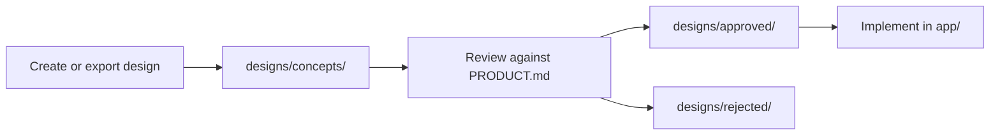

# MileMate — Design Guide

**Document type:** Internal design reference  
**Status:** Active  
**Last updated:** July 2026

---

## Purpose

This document describes how MileMate design work is organized, reviewed, and moved into the app. Product goals and scope live in [PRODUCT.md](./PRODUCT.md). Visual explorations live in `designs/`.

Design decisions should support the product standard:

1. The app should disappear
2. Every tap is a tax
3. Automation beats documentation
4. Confidence over cleverness
5. AI works silently

If a design adds friction, demands attention, or creates conversation, it needs a strong reason to proceed.

---

## Design Principles

### Goal

Reduce cognitive load while driving.

### Feel

- Calm
- Professional
- Trustworthy
- Minimal

### Priorities

Information hierarchy on screen, in order:

1. **Current workday status** — Is a workday active? Is GPS starting or tracking?
2. **Miles** — Live distance for the active workday
3. **Duration** — Elapsed time since workday start
4. **GPS confidence** — Starting vs tracking active; never claim tracking before a valid fix
5. **Actions** — Start Workday / End Workday

Lower-priority content must not compete with items 1–3.

### Never

- Flashy animations
- Cluttered dashboards
- Tiny unreadable text
- Multiple competing colors

### Primary colors

| Color | Role | Current usage |
|-------|------|---------------|
| **Blue** | Navigation, structure | Tab tint, active card border, headings (`#0a7ea4`) |
| **Green** | Active / tracking | Tracking-active indicator (`#1a7f37`) |
| **Red** | Destructive | End Workday button (`#b42318`) |

Use these roles consistently. Do not introduce additional accent colors without a documented reason.

### Philosophy

A driver should understand the screen in under one second.

---

## Design repository structure

```
designs/
├── concepts/     # New ideas under review
├── approved/     # Designs chosen for implementation
└── rejected/     # Explorations ruled out (kept for reference)
```

| Folder | Use when |
|--------|----------|
| `concepts/` | First drop for mockups, wireframes, screenshots, or exports |
| `approved/` | The design is accepted and may inform UI implementation |
| `rejected/` | The design is not moving forward; keep the file for context |

Move files between folders as decisions are made. Do not delete rejected work unless it is redundant or sensitive.

---

## Adding a design

1. Export or save the asset (PNG, JPG, PDF, or SVG).
2. Use a clear, lowercase, hyphenated filename:
   - `home-active-workday-v1.png`
   - `workdays-history-list-v2.pdf`
3. Place the file in `designs/concepts/`.
4. When reviewed, move to `approved/` or `rejected/`.

### Filename pattern

```
[screen-or-feature]-[subject]-[version].[ext]
```

Examples:

- `home-tracking-states-v1.png`
- `workdays-empty-state-v1.png`
- `permission-denied-flow-v1.pdf`

---

## Review workflow



### Review questions

Before moving a design to `approved/`, confirm:

- Can the driver understand it in under one second?
- Does hierarchy follow priorities: status → miles → duration → GPS confidence → actions?
- Does it feel calm, professional, trustworthy, and minimal?
- Does it avoid flashy animation, clutter, tiny text, and competing colors?
- Does it use blue / green / red only in their defined roles?
- Is copy using **Workday** (product), not Trip (technical)?
- Does it avoid claiming tracking is active before GPS confirms?

---

## Screen guidance

### Home (active workday)

Must surface priorities 1–4 clearly: “Workday in progress”, live miles, elapsed timer, and GPS state (starting vs tracking active).

### Home (idle)

Settled and quiet. No urgency cues when no workday is running.

### Workdays (history)

For periodic review. Rows scan quickly: date and distance. No dashboard clutter.

### Permissions

Copy stays workday-focused (`app.json`). Avoid extra permission screens unless product requires them.

---

## Terminology in designs

| Use in mockups & copy | Do not use in user-facing designs |
|-----------------------|-----------------------------------|
| Workday | Trip |
| Start Workday / End Workday | Start Trip / Stop Trip |
| Workdays (tab/history) | Trips |

Technical labels in engineering docs may still say Trip. Design artifacts target drivers, not the data model.

---

## Current implementation reference

The live app (v1) implements a minimal home screen and history list. Approved designs should note whether they are:

- **Polish** — same flows, better layout/visuals
- **Extension** — new screens or flows (e.g. workday detail, export)
- **Replacement** — fundamentally different interaction model

Reference implementation files:

- Home: `app/(tabs)/index.tsx`
- History: `app/(tabs)/history.tsx`
- Tracking logic: `hooks/use-workday-tracker.ts`

---

## Relationship to PRODUCT.md

| PRODUCT.md | DESIGN.md |
|------------|-----------|
| What we build and why | How it should look and feel |
| Scope and roadmap | Visual exploration and approval |
| Engineering principles | UI/UX principles and review |

A design in `approved/` does not automatically enter scope. Implementation still follows PRODUCT.md version boundaries.

---

## Tooling notes

- **Figma / Sketch / screenshots** — export to PNG or PDF for `designs/`
- **Expo Go** — useful for interaction testing; custom permission strings require a dev build
- **Cursor** — reference approved files when asking for UI implementation

---

## Open design questions

Items to resolve through concepts and review:

1. Should the home screen show a map preview, or stay distance-only?
2. How minimal can the active state be while still feeling “alive”?
3. What does the Workdays list row include beyond date and miles?
4. How should low-confidence prompts appear without breaking “the app should disappear”?
5. Dark mode: ship with v1 polish or defer?

Add concepts to `designs/concepts/` as these are explored.
